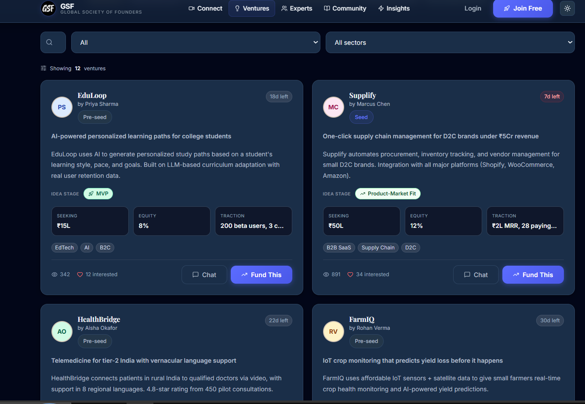
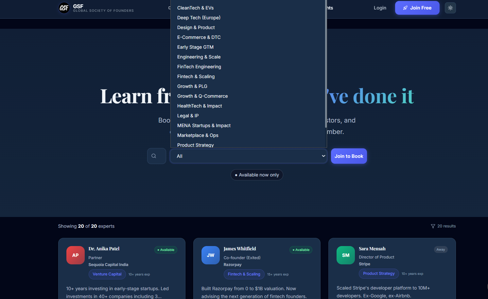
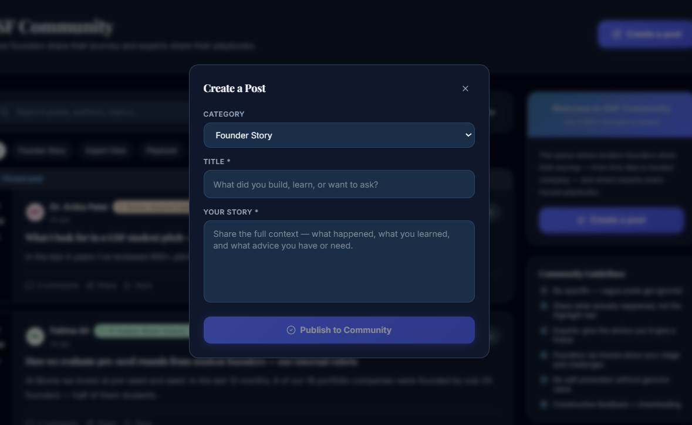
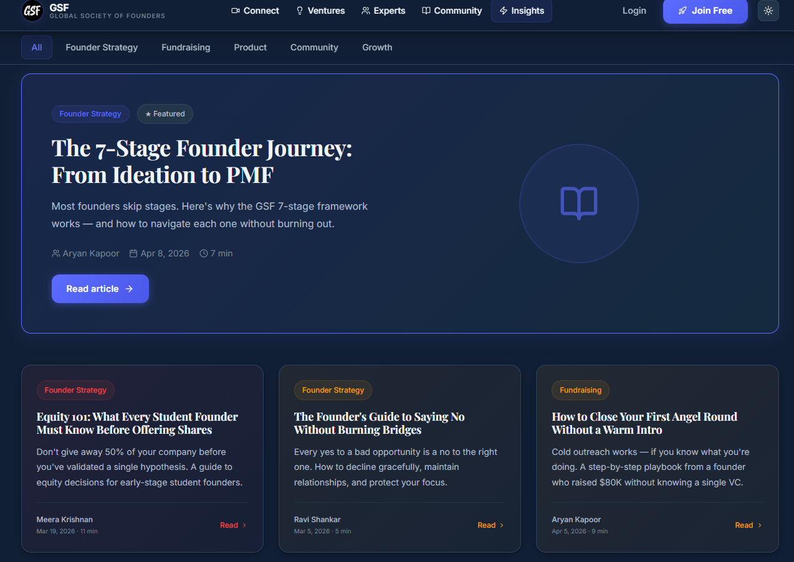
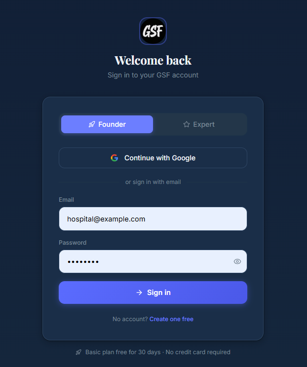

# PR: Fix Dark Mode UI Inconsistency Across All Pages (#1)

Linked issue: #1 —  Fix Dark Mode UI Inconsistency Across All Pages 

## Summary
- Purpose: Make dark mode visually distinct, consistent, and accessible across the application by converting light-first surfaces to dark variants, removing low-contrast glow decorations, and standardizing Tailwind `dark:` patterns.
- Scope: Landing, connect, experts, community, ventures, insights, auth flows, dashboard, and shared UI primitives (`Button`, `Card`, `Badge`, `Input`, `Navbar`, `Sidebar`).

## Motivation
Dark mode was implemented but many UI areas still appear light or washed out in dark mode, causing poor readability and inconsistent UX. This PR standardizes the styling to ensure a clearly different, high-contrast dark theme.

## Changes
- Remove decorative glow blobs and radial-gradient overlays that reduce contrast.
- Add and standardize `dark:` variants for common components (`Button`, `Card`, `Badge`, inputs, selects, dropdowns).
- Centralize and update CSS variables in `app/globals.css` (e.g. `--bg-base`, `--bg-canvas`, `--text-primary`).
- Verify and use theme plumbing in `lib/theme.ts` and `components/layout/ThemeProvider.tsx`; add theme toggle in `Navbar` (desktop + mobile).
- Apply blue→cyan gradient to pricing amount text per design request.

## Files changed (high-level)
- `lib/theme.ts`
- `components/layout/ThemeProvider.tsx`
- `components/layout/Navbar.tsx`
- `components/layout/Sidebar.tsx`
- `app/globals.css`
- `components/ui/Button.tsx`, `components/ui/Card.tsx`, `components/ui/Badge.tsx`
- `components/landing/HeroSection.tsx`, `components/landing/IntroAnimation.tsx`
- `app/page.tsx`, `app/connect/page.tsx`, `app/experts/page.tsx`, `app/community/page.tsx`, `app/ventures/page.tsx`, `app/insights/page.tsx`
- Auth flows: `app/(auth)/onboarding/page.tsx`, `app/login/page.tsx`, `app/sign-up/page.tsx`
- `app/dashboard/credits/page.tsx`

Full diff available in the branch/commit.

## Screenshots (dark mode)
The updated visuals are shown in these images: 

- `public/screenshots/home-hero.png` — Home hero + pricing


- `public/screenshots/ventures-list.png` — Ventures grid/cards



- `public/screenshots/experts-dropdown.png` — Experts page with select open


- `public/screenshots/community-modal.png` — Community post modal


- `public/screenshots/insights-article.png` — Insights hero + cards



- `public/screenshots/login-form.png` — Login/auth card




## How to test
1. Install and run locally:

```bash
npm install
npm run dev
```

2. Open http://localhost:3000 and toggle theme via the sun/moon button in the `Navbar`.
3. Confirm `html` toggles the `dark` class in DevTools.
4. Verify pages/components in both themes:
   - `/` (home): hero, pricing (gradient price text)
   - `/connect`, `/experts`, `/community`, `/ventures`, `/insights`
   - `/login`, `/sign-up`, `/onboarding`
   - `/dashboard/credits`
5. Check interactive states: hover, focus, active, disabled; ensure form inputs are readable with clear borders.

## Checklist
- [x] Navbar has dark styling and theme toggle
- [x] Cards, panels, and sidebars use dark surfaces in dark mode
- [x] Buttons and primary actions have dark variants
- [x] Inputs/selects/search bars readable in dark mode
- [x] Tags/badges contrast updated for dark surfaces
- [x] Removed low-contrast glow/background artifacts


